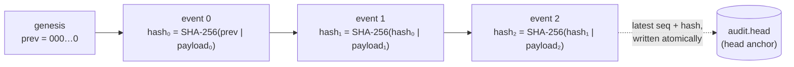
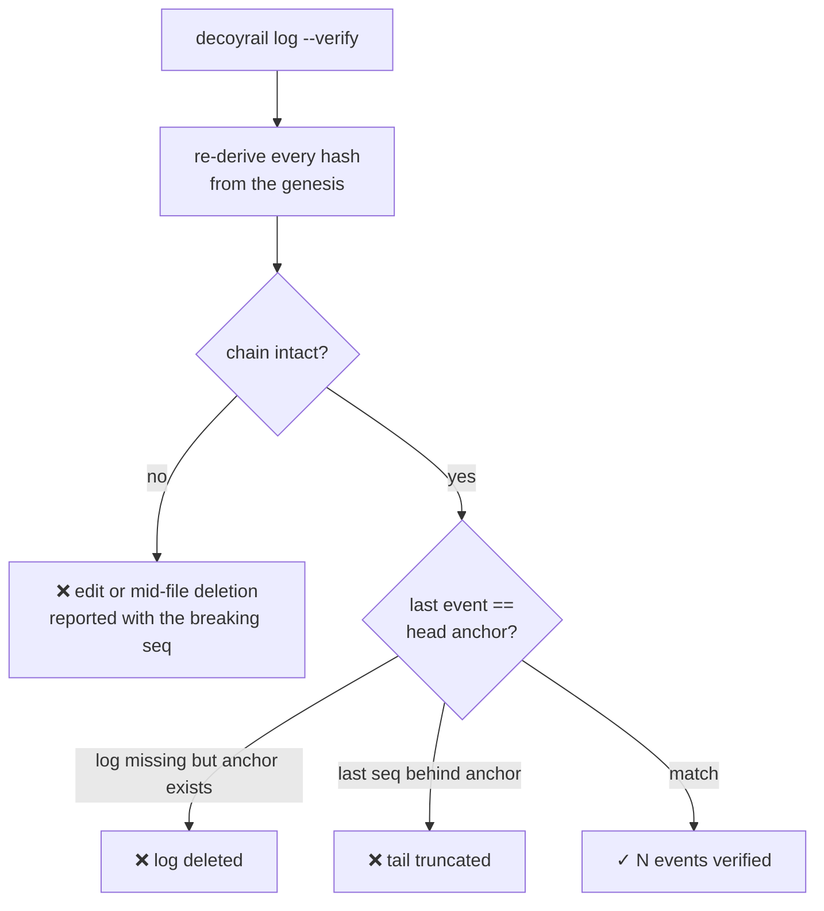
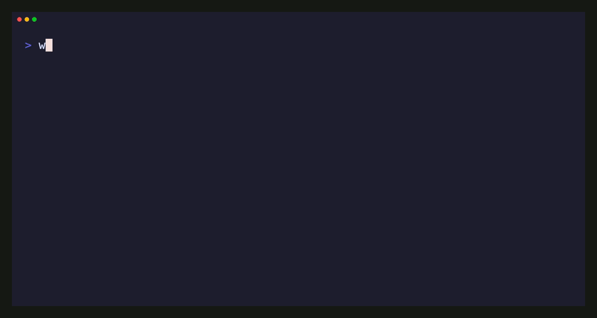

# Audit log & spend metering

Every decision Decoyrail makes (allow, deny, tripwire, response alert) is
appended to a tamper-evident audit log. Alongside it, a meter tracks
per-host traffic and enforces a monthly budget.

## The audit log

`~/.decoyrail/audit.jsonl`: one JSON event per line, append-only.

You rarely need to read the file raw. `decoyrail log` pretty-prints it, and
`decoyrail log -t` follows it live, like `tail -f`. Keeping that open in a
second terminal while an agent runs is the fastest way to see what it is
doing and why something was denied.

```json
{
  "seq": 42,
  "ts": "2026-07-05T17:03:11Z",
  "host": "api.anthropic.com",
  "path": "/v1/messages",
  "method": "POST",
  "action": "allow",
  "rule": "anthropic",
  "escalated": false,
  "swaps": ["anthropic@header:authorization"],
  "tripwires": [],
  "status": 200,
  "note": "",
  "pid": 812,
  "prev_hash": "9f2c…",
  "hash": "a41b…"
}
```

| Field | Meaning |
|---|---|
| `action` | `allow`, `warn` (forwarded under the [warn action](policy.md#warn-forward-but-say-so), no secret released), `deny`, `alert` (real secret echoed in a response, or a config hot-reload failure), `tamper` (a policy load rejected because the file failed integrity verification), `policy` (a policy write or blessing through a Decoyrail surface; the note carries the file's sha256), `session` (a `decoyrail run` or `proxy` launch, labeled in `note`), `usage` (deferred token counts for a streamed response), `cache` (a prompt-cache marker injected, Pro), `keepalive` (a proxy-initiated cache pre-warm, Pro), `downgrade` (a budget soft-landing model rewrite, Pro), or `route` (a [model-router](policy.md#route-allow-on-a-cheaper-model-pro) rewrite, Pro; the note names the mapping and prices any warm prompt cache it forfeits) |
| `rule` | the policy rule that decided it (`default` when nothing matched) |
| `escalated` | the matching rule said `escalate` (resolved via fallback) |
| `swaps` | secrets substituted, as `name@location` |
| `tripwires` | decoys seen off-policy, as `name@location` (including `path`, `encoded:base64`, `body:raw`, `name@response`) |
| `status` | HTTP status returned to the agent (403 deny, 413 cap, upstream status on allow) |
| `note` | human-readable reason (`tripwire: …`, `budget exhausted`, …) |
| `pid` | process id of the decoyrail process that recorded the event (0 on events written before this field existed) |
| `sid` | session id of the recording process, stable where pids get reused; what `decoyrail stats --by session` groups on |
| `dur_ms` | request duration in milliseconds; on streamed responses it moves to the companion `usage` event so nothing is measured twice |
| `bytes_up`, `bytes_down` | request and response sizes as seen at the proxy (omitted when zero) |
| `usage` | structured token counts and cost for LLM requests: `{model, input, output, cache_read, cache_write, cost_usd, ref_cost_usd}` (`ref_cost_usd` is the API-equivalent reference for subscription traffic, present only when nonzero) |
| `req_seq` | on `usage` events: the `seq` of the allow or warn event the counts belong to |

The analytics fields (`sid` through `req_seq`) exist so `decoyrail stats`
can aggregate the log without parsing prose; see [Analytics](stats.md). Like
the pid before them, they are part of the hashed payload: events written
before they existed verify through a fallback, and rewriting any of them on
a real event breaks the chain.

Several decoyrail processes can share one log. To follow a single session,
filter on its pid; `decoyrail run` prints it at launch:

```sh
decoyrail log --pid 812          # only that session's events
decoyrail log -t --pid 812       # follow it live
```

The pid filter applies before `-n`, so `--pid 812 -n 20` means "the last 20
events of session 812", not "session 812's share of the last 20 events".

The log is treated as required, not best-effort. If an append fails (disk
full, permissions, lock error), the error prints to stderr, and for an
allowed request the response is withheld with a `503 audit log unavailable;
failing closed` instead of being delivered. Traffic does not flow
unrecorded. (Denied requests are already blocked, so a failed deny-event
write costs visibility, not enforcement.)

## The hash chain

Each event's `hash` commits to the previous event's hash plus the event's
own canonical payload, so history can't be edited or thinned without
detection:



The payload is hashed as a canonical JSON array (not delimiter-joined
strings), so no crafted field value can shift field boundaries and make two
different events hash identically. The pid is part of the hashed payload;
events written before the field existed still verify through a legacy
fallback, and rewriting a real event's pid breaks the chain.

### What `decoyrail log --verify` catches



- **Edits and mid-file deletions** break a hash link.
- **Tail truncation** leaves a perfectly valid prefix, which is why the
  chain alone isn't enough. The head anchor (`audit.head`, updated
  atomically on every append) records the last sealed `seq` and `hash`; a
  log that verifies but stops short of the anchor was truncated, and a
  missing log with a surviving anchor was deleted.

**Known limit:** an attacker with write access to `~/.decoyrail` can rewrite
the log and the anchor consistently. The anchor defeats naive truncation,
not a full local compromise. Hardware-backed or off-box head storage is on
the [roadmap](../ROADMAP.md), and shipping events to a central log system in
near-real time (which enterprises already do for other logs) bounds the
rewrite window to seconds. See the [threat model](threat-model.md).

### Concurrent writers

Multiple Decoyrail processes (a `decoyrail proxy` plus one or more
`decoyrail run` sessions) can share one log. Appends take an exclusive OS
file lock and re-derive `seq`/`prev_hash` from the tail if another process
wrote in between; without this, each process would chain from stale state
and fork the chain, tripping a false tamper alarm.

## Spend metering & budget

For LLM provider hosts (`api.anthropic.com` and `api.openai.com` out of the
box), metering is exact: the proxy reads the token counts the provider
itself reports in each response (the `usage` fields, including prompt-cache
reads and writes) and prices them per model. Streaming responses are scanned
incrementally as the bytes pass through, so the SSE passthrough stays
untouched. Everything the proxy can't parse falls back to a coarse byte
estimate (about 4 bytes per token at a blended per-provider rate; non-LLM
egress is metered but costed at zero), and `decoyrail status` labels which
number is which.

Billing mode matters for real cost, so Decoyrail tracks it: a request
authenticated the way flat-rate plans authenticate is tagged
`[subscription]` and counted at zero marginal cost. For Anthropic that
means an OAuth `Authorization: Bearer` with no `x-api-key`, the shape
Claude Code sends when signed into a Claude plan. Its tokens still show in `status`, in full; they just
don't burn the budget, because a flat plan adds no per-request bill. That
isn't the same as free: plan allowances are finite, heavy sessions hit plan
limits, and usage beyond the plan bills at API rates.

So every subscription request also carries a **reference cost**: what the
same tokens would have billed at API rates, cache reads and writes priced
at their own multipliers, from the same pricing table as billed traffic.
`status` and `stats` show the total as "plan-absorbed", always labeled
API-equivalent and never summed into spend; the budget and its kill switch
see only billable dollars. It is a reference, what the plan absorbed, not a
savings claim: providers don't publish plan allowances, so Decoyrail never
invents a "percent of plan used".

If you tell Decoyrail what the plan costs, it reads the absorbed total
against that price:

```sh
decoyrail plan --price 200 --label "Claude Max"   # declare what you pay
decoyrail plan          # what the plan absorbed this period, vs its price
decoyrail plan --clear  # remove the declared price
```

With a price declared, `status` and `plan` state one of two things: the
plan absorbed more API-equivalent usage than it costs (it is paying for
itself), or how much of its headroom went unused this period. With no
price declared you get the totals and no verdict. The price is a local
setting you own; if the provider reprices, the declared figure is shown so
a stale number is visible.

```sh
decoyrail status        # tokens + $ per model for LLM hosts, MB for the rest
decoyrail budget 50     # monthly cap in USD; 0 = unlimited
```

## The prompt-cache report

Provider prompt caches cut repeated-context cost by up to 90%, and agent
traffic breaks them constantly, usually by accident: a timestamp in the
system prompt, a tool list that changes order, a request landing just past
the cache TTL. `decoyrail cache` explains what the cache did for you and
what keeps breaking it:

- hit rate per model, and the dollars cache reads saved against full-price
  input (for subscription traffic: the API-equivalent value, which is plan
  headroom),
- what repairable cache misses cost: when a repeating prefix keeps
  re-billing for want of a cache marker, the report prices that waste (a
  byte-derived estimate, marked `~`). On billed traffic it is wasted
  dollars; on subscription traffic it is plan headroom spent on avoidable
  misses, priced at API-equivalent rates,
- whether requests carry cache markers at all,
- prefix stability between consecutive requests: preserved, new
  conversation, diverged, or landed past the 5-minute TTL,
- for the last divergence, the exact byte offset and the section it fell in
  (`system`, `tools[2]`, `messages[7]`), which is usually enough to name
  the timestamp or id that keeps invalidating everything after it.

Token counts come from the same provider-reported usage the meter records.
The request-side diagnosis is observe-only: requests leave byte-identical
whether it runs or not, and its state file (`cache.json`) holds counters,
offsets, and section labels, never prompt content. Diagnosis is free for
everyone.

## Cache repair and active management (Pro)

Diagnosis names the waste; the Pro tier fixes it. All three behaviors are
off by default and switch on in the policy's `[cache]` table (hot-reloaded,
like the rest of the policy); none touches what the model reads, and every
mutation and proxy-initiated request is audited.

- **`repair`**: when a prefix demonstrably repeats (seen at least twice, at
  or above the model's cacheable minimum) but the client sends no cache
  markers, Decoyrail splices an ephemeral `cache_control` marker onto the
  last cacheable block. The edit is byte-surgical on the original request, so
  the text the model reads is untouched; the marker is metadata the model
  never sees. Observed inter-request gaps tune the marker to a 5-minute or
  1-hour TTL. A repaired response carries an `x-decoyrail-cache` header and
  the injection lands in the audit log (`action: cache`). `decoyrail cache`
  reports how many requests were repairable and how many were repaired.
- **`keep_alive`**: during idle (a long local build, say), a warm cache
  lapses and the next request re-pays the full cache write. With keep-alive
  on, the proxy replays a minimal, zero-output version of the last request to
  refresh the cache before it expires. Pre-warms are capped per prefix per
  session, metered as proxy-initiated spend, and audited (`action:
  keepalive`).
- **`serialize_fanout`**: when parallel subagents fire the same prefix at
  once, each one pays for its own cache write. Serialization lets the first
  write the cache and holds the rest until its response starts, so they read
  the warm cache instead, one write and N-1 reads. A per-request timeout keeps
  a stalled leader from wedging its siblings.

These are Pro features: without a license, or with the knobs left off, the
proxy runs the free, observe-only doctor and forwards every request
byte-identical.

Per-model rates ship built in. `~/.decoyrail/pricing.json` (hot-reloaded)
overrides or extends them, maps extra hosts to a provider protocol (an
internal gateway, say), and can force a billing mode per host:

```json
{
  "hosts":   {"llm.corp.internal": "openai"},
  "billing": {"api.anthropic.com": "subscription"},
  "models":  {"claude-sonnet-5": {"input": 3.0, "output": 15.0,
              "cache_read": 0.3, "cache_write": 3.75}}
}
```

How it behaves:

- **Kill switch:** once the month's spend (metered plus estimated) reaches
  the budget, every request is denied (`budget exhausted` in the audit log)
  until the month rolls over or the budget is raised. The check runs before
  forwarding. Subscription traffic never trips it.
- **Streams are metered too:** for SSE and oversized responses, the upload
  is recorded at forward time and the download size is folded in as the
  stream drains, including when the agent disconnects mid-stream. Token
  usage is scanned out of the SSE events on the fly, one line buffer deep,
  never delaying the stream. Some subscription backends stream SSE without
  the `text/event-stream` content type (ChatGPT's Codex endpoint,
  `chatgpt.com/backend-api/codex/responses`, is one); their usage is still
  recovered by scanning the buffered body as SSE when a whole-body JSON
  parse finds none.
- **Token counts land in the audit log:** an allowed LLM request's event
  carries a `usage: <model> in=… out=…` note when the response was buffered;
  streamed responses append a companion `usage` event once the stream ends
  and the counts are known. Neither adds latency: the buffered counts were
  already parsed for metering, and the companion event is written after the
  last byte has been delivered.
- **Global across sessions:** each session accrues a local delta and merges
  it into `meter.json` under a file lock, then folds other sessions' flushed
  usage back in. Two concurrent `decoyrail run`s add up instead of
  overwriting each other, so the budget is enforced machine-wide, not
  per-session.
- **The budget lives in its own file** (`budget.json`), so the proxy's
  frequent usage writes can never clobber a budget you set while it was
  running. Both hot-reload into a running proxy.

## The spend tripwire

The monthly budget is a backstop, and it fires far too late for an agent that got stuck at 2am retrying the same failing request. The spend tripwire watches for runaway behavior in near real time and trips in minutes, not at the end of the month. It is a safety feature, so it ships in the free tier, on by default, and no license state affects it.



Two purely mechanical signals, no guessing about intent:

- **Repetition:** the same request (same destination, method, and body) seen `repeats` times inside the sliding window. Fifteen byte-identical LLM calls in five minutes is a loop, not a retry.
- **Rate:** the window's metered spend far above the session's own earlier pace, past both a multiplier and an absolute dollar floor. A young session has no baseline yet and cannot rate-trip; the repeat detector and the kill switch still stand.

It is configured in the policy's `[spend_tripwire]` table (hot-reloaded like the rest), shown here with its defaults:

```toml
[spend_tripwire]
mode = "block"          # block | alert | off
repeats = 15
window_secs = 300
rate_multiplier = 10.0  # 0 disables rate detection
rate_floor_usd = 5.0
```

Only LLM-bound traffic (hosts the pricing table maps to a provider) is watched and, on a trip, blocked; `git push` and `cargo fetch` keep flowing. In `block` mode the tripping request and everything LLM-bound after it get a 403 whose JSON body names the trigger, the counts, and the clear command, so a coding agent can read why its requests stopped and break its own loop. In `alert` mode the trip is recorded once and traffic keeps forwarding: visibility before enforcement, same as the DLP detectors' warn posture.

A trip is deliberately sticky. It persists to `trip.json`, survives a proxy restart, reaches every session sharing the state dir, and also stops Pro keep-alive pre-warms (quiet recurring spend is exactly what a tripped session must not keep accruing). Nothing clears it but an operator: `decoyrail trip` shows the trip and `decoyrail trip clear` clears it, resets detection state, and writes its own audit event. `decoyrail status` puts a standing trip on the front page, and `decoyrail log -t` renders the events with `[TRIP]` prominence, same as the honeytoken alarm: both are tripwires, one on secrets, one on cost.

The audit events carry a salted fingerprint of the repeated request and the counts, never request content, exactly like DLP hits. If your agent legitimately polls one endpoint with identical bodies, raise `repeats` or widen `window_secs` for your traffic; the defaults are chosen so ordinary retry-with-backoff never gets close.

## Budget soft-landing (Pro)

The kill switch is binary: under budget everything flows, at 100% everything stops. Soft-landing adds a band in between. Past a threshold you set, requests that name a model in your downgrade map are rewritten to the cheaper model, so the agent keeps working at lower cost instead of hitting the wall at speed. At 100% the kill switch still stops everything, exactly as above.

It switches on in the policy's `[soft_landing]` table (hot-reloaded, like the rest of the policy) and is off by default:

```toml
[soft_landing]
threshold_pct = 80
map = { "claude-opus-4" = "claude-sonnet-5", "gpt-5" = "gpt-5-mini" }
```

The map is yours. Decoyrail has no built-in opinion about which models are equivalent, and a model with no entry forwards untouched. Only the top-level `model` field of recognized LLM request bodies (the Anthropic and OpenAI JSON shapes) is rewritten, byte-surgically, so everything else in the request is exactly what the client sent. A request whose model can't be identified passes through unchanged; Decoyrail never guesses. A map that names a target model the pricing table doesn't know still forwards as configured (the provider errors informatively), and the audit note flags the likely typo.

Downgrades never happen silently:

- every rewritten request gets a `downgrade` audit event naming the mapping and the budget fraction that triggered it,
- the response carries an `x-decoyrail-downgrade: <from> -> <to>` header,
- `decoyrail status` says when the session is in the degraded band.

One caveat, which the audit note also states: provider prompt caches are model-scoped, so a model rewrite invalidates the warm cache and the first downgraded request pays a cold cache write for the new model. The visibility exists so that cost stays attributable instead of mysterious.

When a [route rule](policy.md#route-allow-on-a-cheaper-model-pro) also matches, soft-landing rewrites first and the route map applies to the result, each with its own audit event.

The threshold reads the same billable spend as the kill switch, so subscription traffic never pushes a session into the band. This is a Pro feature: without a license, or with the table absent, behavior is exactly today's, nothing between a healthy budget and the hard kill switch.
