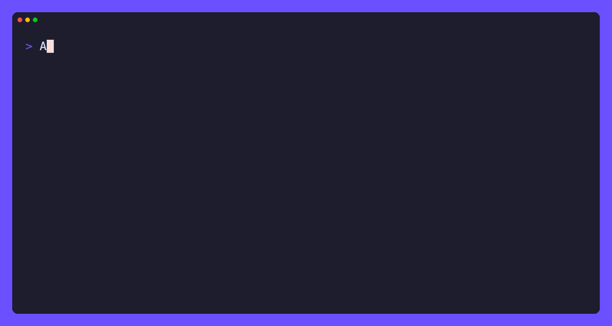

# Getting started with Decoyrail

This guide runs an AI agent behind Decoyrail. For command help, run
`decoyrail --help` or `decoyrail <cmd> --help`. See [How it works](how-it-works.md)
for the architecture; the [documentation index](README.md) links to each
reference.

## The 30-second mental model

```
your agent                   Decoyrail proxy                     the internet
(holds decoys only)          (the trusted boundary)
───────────────────          ──────────────────────────────      ───────────────────

ANTHROPIC_API_KEY            request to an approved host:
  = sk-ant-…DECOY   ──────►  swap the decoy for the real  ────►  api.anthropic.com
                             secret, forward over real TLS       (sees the REAL key)

ANTHROPIC_API_KEY            request to anywhere else:
  = sk-ant-…DECOY   ──────►  TRIPWIRE: block and record     ✗    evil.example.com
                             (real secret never leaves)          (sees nothing)
```

The agent only ever holds decoys. Real secrets live encrypted in the vault
and are swapped in only at destinations whose policy rule releases them.
Anything off-policy is denied, and a decoy seen heading off-policy is
recorded as an exfiltration attempt. Here is the second half of that diagram,
live:


## 1. Install

The macOS build (Apple Silicon) installs with Homebrew:

```sh
brew install decoyrail-team/tap/decoyrail
```

No Homebrew? The [install section of decoyrail.com](https://decoyrail.com/#download)
has the manual tarball path. Decoyrail is source-available, so you can also
build the exact same binary yourself with `cargo build --release`.

No database, no Docker, no daemon. All state lives in `~/.decoyrail/`.

## 2. Protect Claude Code, step by step

### Step 1: trust the device CA (one time)

Decoyrail intercepts TLS with a per-device CA it generates on first use. Your
agent's HTTPS client must trust it.

```sh
decoyrail ca install     # adds the CA to the macOS login keychain (prompts for your password)
decoyrail ca path        # prints where the CA cert lives, if you want to inspect or export it
```

`decoyrail run` (step 2) also passes the CA to the child via `SSL_CERT_FILE`,
`NODE_EXTRA_CA_CERTS`, `REQUESTS_CA_BUNDLE`, and `CURL_CA_BUNDLE`, so most
CLIs pick it up even without the keychain install.

### Step 2: run the agent behind Decoyrail

```sh
decoyrail run -- claude
```

Decoyrail starts an embedded proxy, configures the child to use it and trust
its CA, injects decoys, and launches `claude`. For Claude Code subscriptions
(`/login`), this is the whole setup: OAuth passes through unchanged while
Decoyrail applies default-deny egress, auditing, and automatic env-var
decoying.

> Everything after `--` is the command and its args, run verbatim:
> `decoyrail run -- claude --model claude-fable-5`,
> `decoyrail run -- codex`, `decoyrail run -- npm test`, and so on.

While the agent works, keep a second terminal open with:

```sh
decoyrail log -t
```

It follows each allow, deny, swap, and tripwire live. Use it to see which
hosts the agent contacts and which legitimate hosts the policy blocks.

### Step 3 (API keys only): vault the key

Skip this if you authenticate with a subscription. If you pay per token via
`ANTHROPIC_API_KEY`, don't hand the agent the real key; vault it instead:

```sh
decoyrail vault add \
  --name anthropic \
  --env ANTHROPIC_API_KEY \
  --location bearer
# You'll be prompted for the secret (hidden). It never touches your shell history.
```

What each flag means:

| Flag | Purpose |
|---|---|
| `--name` | A label for this entry (used by `vault ls`/`rm`, and by the policy's `allow_secrets`). |
| `--env` | The env var `decoyrail run` injects the decoy into for the child. |
| `--location` | Where the secret rides in a request. See [Locations](#5-locations-where-in-the-request-a-secret-rides) below. |
| `--allow-host` | Append a policy rule releasing this secret at HOST. Not needed here: the key's `sk-ant-` format gives it the `anthropic` provider label, and the default policy already releases that at `api.anthropic.com`. |
| `--secret` | The value. Omit it to be prompted hidden (recommended), pass `-` to read stdin, or pass the literal value (it will land in shell history). |

The policy controls where the real key may go. A rule's `allow_secrets`
lists entries by name or provider label. Confirm the entry and its release
destinations with `vault ls` (the real value is redacted):

```sh
decoyrail vault ls
# anthropic  env=ANTHROPIC_API_KEY  loc=Bearer released at api.anthropic.com
#     real=sk-a…7f (108 chars)  decoy=sk-ant-api03-…
```

Now `decoyrail run -- claude` injects the decoy: Claude sees
`ANTHROPIC_API_KEY=sk-ant-…DECOY`, `api.anthropic.com` receives your real
key, and anywhere else the decoy shows up is blocked and recorded.

Optional hardening on macOS: `decoyrail key migrate --to keychain` moves
the vault's encryption key off disk and into the login keychain, where
reading it silently is something only the Decoyrail binary can do. See
[where the key lives](vault-and-bindings.md#where-the-key-lives-file-or-keychain).

### Step 4: see what happened

```sh
decoyrail log -t           # follow live, like `tail -f` (worth keeping open in its own terminal)
decoyrail log -n 20        # recent egress decisions
decoyrail log --pid 812    # only the events of one session (decoyrail run prints its pid at launch)
decoyrail log --verify     # verify the tamper-evident hash chain
decoyrail status           # spend and budget per destination
```

A healthy session looks like:

```
[ ok ] 2026-07-05T… pid=812    POST   api.anthropic.com/v1/messages  [anthropic]
        swapped: anthropic@header:authorization
[DENY] 2026-07-05T… pid=812    POST   telemetry.example.com/collect  [default] denied by policy
```

## 3. Automatic decoying: env vars

Vault entries cover the secrets you added explicitly. `decoyrail run` also
protects, by default, the credentials it finds in the terminal environment.



Decoyrail scans the child's environment for credential-shaped names (`*_TOKEN`, `*_SECRET`,
`*_PASSWORD`, `*_API_KEY`, `AUTH` as a name segment, and similar) and known
value formats (`sk-ant-…`, `ghp_…`, `AKIA…`, PEM private keys, connection
strings with inline passwords). Each match is replaced with a decoy.
Recognized provider keys stay usable (the default policy releases them at
their provider's API); everything else becomes a tripwire the child cannot
use, and any attempt to send it is blocked and recorded. The mechanics are
in [vault & secret release](vault-and-bindings.md#the-session-vault-automatic-decoys-for-decoyrail-run).
To make a tripwire-only credential usable, release it by its session name (`env:` plus
the variable) in the destination's policy rule, for example
`allow_secrets = ["env:DATABASE_URL"]`; see
[policy](policy.md#allow_secrets-which-credentials-travel-with-a-rule).

The launch banner lists exactly what was decoyed and whether each item stays
usable. To opt out:

```sh
decoyrail run --pass-env DATABASE_URL -- <cmd>    # pass one env var through unchanged
decoyrail run --pass-all-env -- <cmd>             # disable env scanning entirely
```

`--pass-all-env` does not affect vault entries: a variable you bound with
`vault add --env` still gets its decoy in every mode.

Session decoys are deterministic (derived from the variable name and value),
so they are stable across runs, and they are never written to disk.

## 4. Secret entry: keep it out of history

`decoyrail vault add` accepts the secret three ways, in order of safety:

```sh
# a) Prompted, hidden (default when --secret is omitted on a terminal):
decoyrail vault add --name gh --location bearer

# b) Piped from another tool (read as a single line):
op read "op://vault/github/token" | decoyrail vault add --name gh --location bearer --secret -

# c) Inline (visible in shell history and `ps`; decoyrail prints a warning):
decoyrail vault add --name gh --location bearer --secret ghp_xxx
```

## 5. Locations: where in the request a secret rides

The `--location` says where in the request the secret travels, which is how
Decoyrail finds the decoy to swap:

| `--location` | Matches | Example service |
|---|---|---|
| `bearer` | `Authorization: Bearer <secret>` | Anthropic, OpenAI, many APIs |
| `header:x-api-key` | a named header carries the raw secret | some vendor APIs |
| `body` | the secret appears in the request body | webhook signing keys, form posts |
| `any` | search headers and body (default) | when unsure |

Where the secret may *go* is the policy's job. `--allow-host` appends the
releasing rule for you; keys with a recognized provider format are already
released by the default policy's provider rules. Examples:

```sh
# OpenAI (bearer): released by the default policy's openai rule.
decoyrail vault add --name openai --env OPENAI_API_KEY --location bearer

# A vendor that uses a custom header:
decoyrail vault add --name acme --env ACME_KEY \
  --allow-host api.acme.com --location header:x-api-key

# A DB URL your agent shouldn't be able to send anywhere but your API:
decoyrail vault add --name db --env DATABASE_URL \
  --allow-host api.internal.example.com --location body
```

For a narrower release (one path prefix, specific methods), edit the
appended rule in the [policy](policy.md):

```toml
[[rule]]
name = "acme"
hosts = ["api.acme.com"]
path_prefixes = ["/v1"]
methods = ["POST"]
action = "allow"
allow_secrets = ["acme"]
```

## 6. Editing the egress policy

The policy is a plain, human-editable TOML file, default-deny, created with
a starter pack for coding agents on first run.

```sh
decoyrail policy show                # print the current policy
$EDITOR "$(decoyrail policy path)"   # edit it
```

Rules are evaluated top to bottom; the first match wins:

```toml
default_action = "deny"          # everything not matched below is blocked
escalate_fallback = "deny"       # `escalate` fails closed (no judge tier yet)

[[rule]]
name = "anthropic"
hosts = ["api.anthropic.com"]
action = "allow"
allow_secrets = ["provider:anthropic"]   # secrets released at this destination

[[rule]]
name = "package-registries"
hosts = ["registry.npmjs.org", "pypi.org", "*.pythonhosted.org", "crates.io"]
action = "allow"

[[rule]]
name = "watch-these"
hosts = ["pastebin.com", "*.ngrok-free.app"]
action = "escalate"              # today: denied and flagged; later: routed to a judge or a human
```

The same rule that allows a destination says which secrets travel there:
`allow_secrets` lists vault entry names or provider labels, and everything
not listed stays a decoy. The [policy reference](policy.md) covers the
semantics. The proxy hot-reloads the policy; no restart needed.

The policy file also holds the [sensitive-data detectors](dlp.md), which
scan every outbound request for card numbers, SSNs, and bank identifiers,
whatever the destination. They ship in warn mode, so hits show up as
`[ALRT]` events in `decoyrail log -t` without breaking anything; tighten
them once you have watched your own traffic:

```toml
[dlp]
pan = "block"    # now a card number in a request is rejected outright
ssn = "warn"     # still just recorded
iban = "warn"
aba = "warn"
email = "off"
```

Or from the CLI: `decoyrail dlp show` and `decoyrail dlp set pan block`.

## 7. Point other apps at Decoyrail (standalone proxy)

`decoyrail run` is the easiest path, but you can also run the proxy as a
shared endpoint and point any HTTP(S) client at it:

```sh
decoyrail proxy                         # listens on 127.0.0.1:9077
```

```sh
# Any tool that honors proxy env vars and a custom CA:
export HTTPS_PROXY=http://127.0.0.1:9077
export SSL_CERT_FILE="$(decoyrail ca path)"
curl https://api.github.com/zen
```

This is also how an IT team routes a GUI app (Claude.app, for example) at
Decoyrail via system proxy settings, without per-process wrapping.

## 8. Enterprise internal CA (upstream trust)

Decoyrail verifies the real upstream's TLS against the OS trust store. Its
interception is client-facing only, never a downgrade. If your agents talk
to services behind a corporate internal CA, add that CA as an extra upstream
trust root:

```sh
export DECOYRAIL_EXTRA_CA=/etc/ssl/corp-root.pem
decoyrail run -- claude
```

`DECOYRAIL_EXTRA_CA` only adds a trust anchor; it never disables verification.

## 9. Cost control

```sh
decoyrail budget 50      # cap monthly spend at $50; deny once exhausted
decoyrail budget 0       # unlimited (default)
decoyrail status         # tokens + $ per model for LLM hosts, MB for the rest
decoyrail cache          # prompt-cache hit rate, savings, and what breaks it
```

For Anthropic and OpenAI, Decoyrail uses provider-reported token counts,
including cache reads and writes. A built-in table prices them; override it
in `~/.decoyrail/pricing.json`.
Requests billed to a flat subscription (Claude Code signed into a Claude
plan, for example) are tagged `[subscription]` and tracked at zero marginal
cost; their tokens are still counted in full, since plan allowances are
finite and excess usage may bill at API rates. Unparsed traffic falls back
to a labeled byte-based estimate. See [Audit & metering](audit-and-metering.md).

## 10. Throwaway and isolated runs

All state resolves under `DECOYRAIL_HOME` (default `~/.decoyrail`). Point it
at a temp dir to experiment without touching your real config; the test
suite and `scripts/e2e.sh` do exactly this:

```sh
DECOYRAIL_HOME="$(mktemp -d)" decoyrail vault add --name demo --allow-host localhost --secret sekret
```

## 11. Verify a source build

If you built Decoyrail from source, you can check your build end to end:

```sh
cargo test                          # unit + in-process integration tests
cargo test --test proxy_integration # the Rust end-to-end pipeline test
bash scripts/e2e.sh                 # live e2e against a local TLS upstream (offline-safe)
```

`scripts/e2e.sh` exercises the whole chain: TLS interception, the
decoy-to-real swap on an approved host, a tripwire block on an off-policy
decoy, a policy deny on an unknown host, and audit-chain verification.

## 12. Uninstall cleanly

One command removes everything Decoyrail installed:

```sh
decoyrail uninstall
```

It removes, in order:

- the **Decoyrail CA** from your login keychain. It is identified by its
  SHA-1 fingerprint, never by name, so nothing else in your keychain can be
  touched, and running it again is harmless.
- the **vault-key keychain item**, if you migrated the vault key to the
  keychain with `decoyrail key migrate`.
- the whole **state directory** (`~/.decoyrail`): vault, CA material,
  policy, audit log, meter, and caches.

It then prints the two things it can't do for itself: deleting the binary
(it tells you the exact path) and removing any PATH line you added to your
shell profile. If you only want to stop trusting the CA but keep your
config, use `decoyrail ca uninstall` on its own. Both commands are safe to
repeat; if the trust root was already removed by hand, they say so and
carry on.

## Troubleshooting

**`cargo` hangs or fails to fetch while inside `decoyrail run`.** Your shell
has `HTTPS_PROXY` set and the default policy blocks crates.io. Clear the
proxy env for cargo:
```sh
env -u HTTP_PROXY -u HTTPS_PROXY -u http_proxy -u https_proxy cargo build
```

**TLS errors or "certificate not trusted" from the agent.** The Decoyrail CA
isn't trusted by that client. Run `decoyrail ca install`, or check that the
client honors the `SSL_CERT_FILE`/`NODE_EXTRA_CA_CERTS` that `decoyrail run`
sets. Some apps pin certificates and can't be intercepted by design; for
those, only policy allow/deny applies (no body inspection).

**Everything is denied.** That's the default-deny posture working. Run
`decoyrail log -t` in a second terminal while the agent works to see exactly
which hosts are being denied, then add allow rules for the legitimate ones
(`decoyrail policy path`), or start from the shipped default pack.

**A legitimate request tripped the tripwire.** The secret reached a
destination no policy rule releases it to. Add the destination to the
rule's `allow_secrets` (or widen the rule's hosts/paths/methods) to match
where the credential is actually used. `decoyrail vault ls` shows where
each secret is currently released.

**A tool broke because its credential was auto-decoyed.** The launch banner
lists what was decoyed. Either add that secret to the vault and release it
in the policy (`--allow-host` does both in one command) so it keeps working
through the swap, or pass it through with `--pass-env VAR` if you accept
the exposure.

**Debugging the proxy.** Set `DECOYRAIL_DEBUG=1` to print per-connection
errors (suppressed by default, since clients disconnect routinely).
