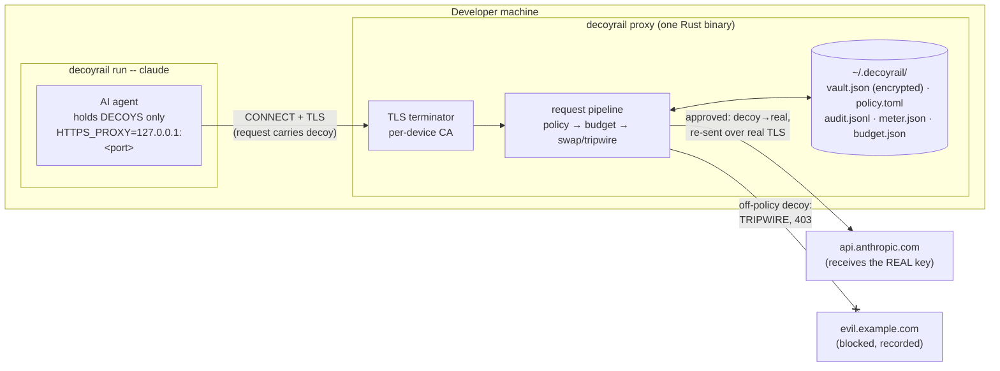
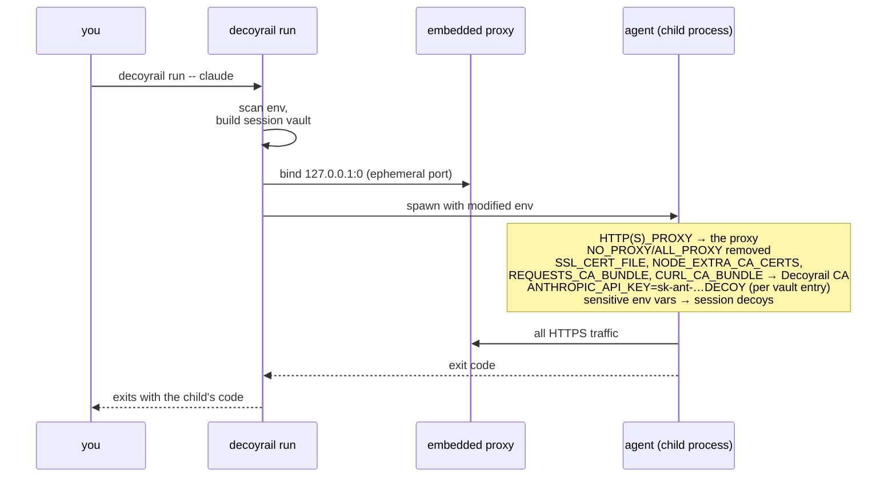
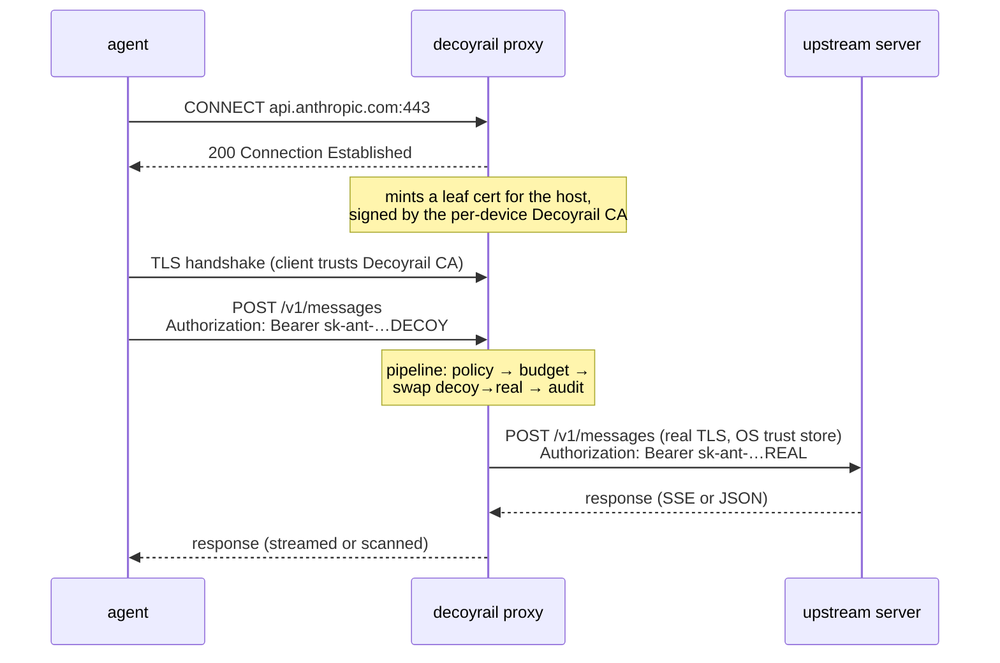
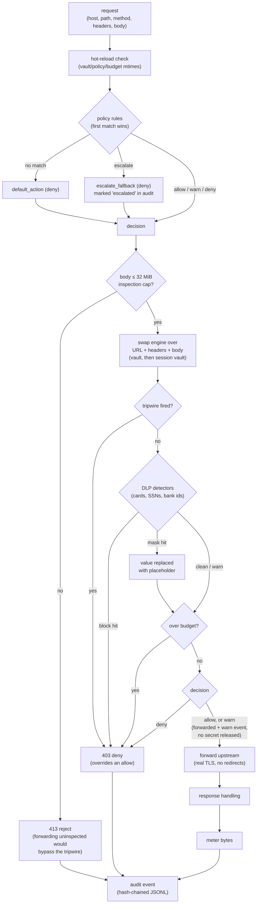
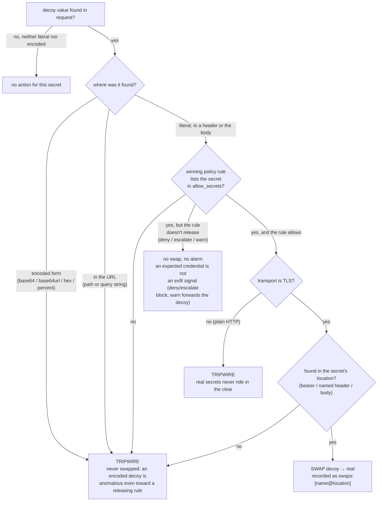
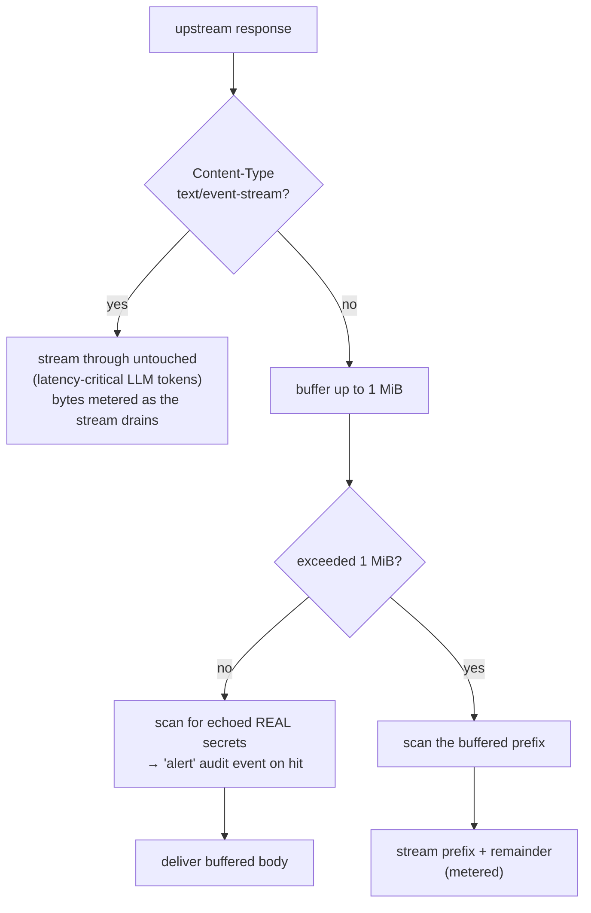
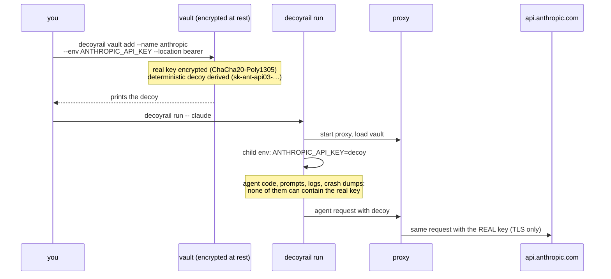

# How Decoyrail works

Decoyrail is a local, TLS-intercepting proxy that sits between an AI agent
and the network. The agent is given decoy credentials; Decoyrail swaps in
the real secret only for each secret's approved destination, blocks
everything off-policy, and treats a decoy seen anywhere else as an
exfiltration attempt.

This page walks the actual code paths. Companion references:
[policy](policy.md) · [vault & secret release](vault-and-bindings.md) ·
[audit & metering](audit-and-metering.md) · [threat model](threat-model.md).

## The big picture



Three ideas carry the design:

1. **The agent never holds a real secret.** `decoyrail run` injects decoys
   into the child's environment. Real secrets live encrypted in the vault
   and exist only inside the proxy, in the moment between interception and
   forwarding.
2. **The policy rule that wins a request decides what it may carry.** A
   rule's `allow_secrets` lists the secrets released at the destinations it
   matches; the substitution happens only when the winning rule resolves to
   allow, only over TLS, and only in the location the secret rides in
   (which header, or the body).
3. **Decoys are honeytokens.** A decoy observed heading anywhere the winning
   rule does not expect it means some code tried to exfiltrate a credential.
   The request is blocked and the event is recorded, so the attempt itself
   becomes evidence.

## What `decoyrail run` sets up



`NO_PROXY` and `ALL_PROXY` are removed from the child env deliberately: an
inherited `NO_PROXY` would punch silent holes in egress coverage.

Besides the vault entries, `decoyrail run` builds a **session vault** before
spawning the child: sensitive-looking env vars (credential-shaped names,
known key formats) are replaced with decoys in the child's environment.

Session secrets live only in the proxy's memory, in a vault kept separate
from the persistent one (so a hot reload of `vault.json` cannot drop them),
and go through the same swap/tripwire pipeline. Which of them stay usable
and which are tripwire-only is covered in
[vault & secret release](vault-and-bindings.md#the-session-vault-automatic-decoys-for-decoyrail-run);
`--pass-env` and `--pass-all-env` opt out. See
[getting started](getting-started.md#3-automatic-decoying-env-vars)
for the user-facing behavior and the
[threat model](threat-model.md#automatic-decoying-is-best-effort-coverage)
for the limits.

## Connection handling: CONNECT + TLS interception



Details that matter:

- The tunnel port is preserved: a `CONNECT host:8443` reaches the
  upstream on 8443. Hostnames are lowercased once so policy, secret
  release, and audit all see one canonical form.
- The interception is client-facing only. The upstream connection is a
  fresh, fully verified TLS session against the OS trust store (plus
  `DECOYRAIL_EXTRA_CA` for enterprise internal CAs, which adds a trust
  anchor and never disables verification).
- The upstream client follows no redirects. A redirect followed after
  the swap would carry the real secret to a destination policy never
  evaluated. The 3xx is relayed to the agent instead, and its follow-up
  request re-enters the pipeline like any other. The upstream client also
  ignores proxy env vars (Decoyrail is the proxy).
- Plaintext HTTP proxy requests run the same pipeline, but with swapping
  disabled; see the tripwire rules below.

## The request pipeline

Every intercepted request runs this, in order:



Three overrides are absolute: a tripwire, a blocking DLP detector
hit ([sensitive-data filtering](dlp.md)), or an exhausted budget denies
even when policy said allow or warn. In the tripwire case the real secret
was never substituted in, so nothing sensitive was staged for sending.

Denials return a JSON body the agent can understand:

```json
{"decoyrail": true, "blocked": true, "message": "decoyrail blocked this request: …"}
```

(403 for policy/tripwire/budget denials, 413 over the inspection cap, 502
for upstream failures.)

## Swap vs. tripwire: the decision per secret

For each secret (vault and session vault), against each request:



The corner cases:

- **Encoded decoys always tripwire, never swap.** Base64 (padded and
  unpadded), URL-safe base64, hex (both cases), and percent-encoding of
  every decoy are searched in the URL, headers, and body. Compression or
  encryption before sending can evade a stateless scan; see the
  [threat model](threat-model.md) for why the prevention guarantee doesn't
  depend on catching it.
- **A decoy in the URL always tripwires.** Query strings are how API keys
  of the `?key=…` style and webhook URLs leave. The path is never a
  swappable location, so a URL-borne decoy is never swapped, even under a
  releasing rule.
- **A decoy in the wrong place tripwires even under a releasing rule.** If
  the secret's location is `bearer` and the decoy shows up in
  `x-custom-header`, that's a tripwire, not a swap.
- **A decoy in a non-UTF-8 body** (binary or multipart upload) can't be
  swapped, but the literal bytes are still searched and tripwire as
  `body:raw`.
- **Plain HTTP never gets a real secret**, even under a releasing rule: the
  swap is gated on TLS, and the decoy tripwires instead.
- **A secret listed on a deny or escalate rule blocks quietly.** The
  default policy's telemetry and gist carve-outs list the provider label,
  so the agent's own credential riding those blocked calls doesn't page
  anyone. The request is still denied and audited.
- **A secret listed on a warn rule forwards quietly, as the decoy.** The [warn action](policy.md#warn-forward-but-say-so) never releases anything; the destination receives the decoy and the request is audited as a warn event.

## Response handling: stream fast, scan what's bounded



The response-side scan looks for real secret values coming back (a
misconfigured upstream echoing credentials). A hit records an `alert` audit
event; the response is still delivered, because by that point the bytes were
already in flight, so the scan is telemetry. SSE streams skip
scanning entirely, to keep added latency on token streams low.

## A secret's lifecycle



Decoys are deterministic (derived from the entry name and the real
value), so re-adding the same secret reproduces the same decoy and old audit
history stays meaningful. They're format-correct (`sk-ant-api03-…`,
`ghp_…`, `AKIA…`) so agents, SDKs, and validators accept them without
special-casing; see [vault & secret release](vault-and-bindings.md) for the format
table.

## Hot reload

The proxy picks up edits without a restart. Once per request it stats the
hot-reloadable files and reloads any whose mtime changed:

- `vault.json`: new or removed secrets apply immediately
- `policy.toml`: rule and `allow_secrets` edits apply immediately
- `budget.json`: budget changes apply immediately
- `pricing.json`: model rate / provider host / billing overrides apply
  immediately
- `meter.json`: spend from other concurrent decoyrail sessions is merged in,
  so the budget kill switch is global, not per-session

When nothing changed this costs a handful of `stat()` calls. Session-vault secrets
are unaffected by reloads; they live in memory for the run.

A changed file that fails to load (say, a `policy.toml` edit with a TOML
syntax error) does not take the proxy down and does not half-apply: the
previous version stays active, and the failure is announced on stderr and as
an `alert` event in the audit log. Without that alert, a broken policy push
would look deployed while endpoints kept enforcing the old rules.

A policy edit made outside Decoyrail's own surfaces is a different story
told separately: the file fails integrity verification, the previous policy
stays active, and the rejection is a `tamper` event with alarm prominence
(`[TAMP]` in `decoyrail log -t`). Hand edits take effect after
`decoyrail policy sign`; see the
[policy reference](policy.md#integrity-out-of-band-edits-never-load).

## Everything lives in `~/.decoyrail`

The directory is created `0700` (existing directories from older installs
are tightened on next run).

| File | Contents |
|---|---|
| `ca-cert.pem` / `ca-key.pem` | per-device CA (leaf certs minted per host); the key is `0600` |
| `vault.json` | encrypted vault (ChaCha20-Poly1305) |
| `vault.key` | vault key, `0600`; absent when the key lives in the login keychain instead (release installs start there, `decoyrail key migrate` moves it either way) |
| `policy.toml` | egress policy, human-editable (hand edits need `decoyrail policy sign`) |
| `policy.toml.sig` | policy integrity record; the proxy loads only a policy that verifies against it |
| `audit.jsonl` + `audit.head` | hash-chained audit log + head anchor |
| `meter.json` / `budget.json` | per-host spend accounting (per-model token counts for LLM hosts) / monthly budget |
| `pricing.json` (optional) | per-model rate, provider host, and billing overrides |

Set `DECOYRAIL_HOME` to relocate all of it (tests and the e2e script point
it at a temp dir). `DECOYRAIL_DEBUG=1` prints per-connection errors;
`DECOYRAIL_EXTRA_CA` adds an upstream trust root.
