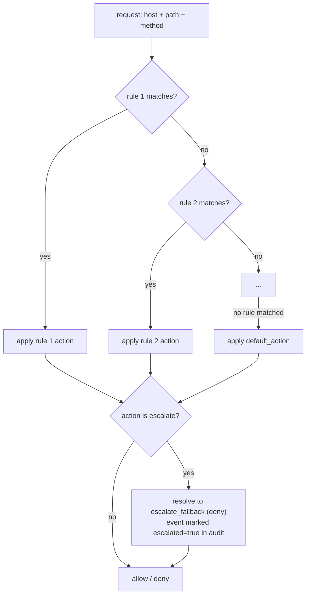

# Policy reference

Decoyrail's egress policy decides, for every intercepted request, whether it
may leave the machine. It is a plain TOML file, `~/.decoyrail/policy.toml`,
created with a default pack on first run and hot-reloaded by a running proxy.

```sh
decoyrail policy show               # print the current policy
$EDITOR "$(decoyrail policy path)"  # edit it; a running proxy picks it up
```

You can also drive the rules from the command line, the way `iptables` does,
without opening the file. Every write validates before it lands, keeps the
comments and rules it doesn't touch, and hot-reloads into a running proxy. See
[Editing from the CLI](#editing-from-the-cli) below.

## File format

```toml
default_action = "deny"       # applied when no rule matches
escalate_fallback = "deny"    # what `escalate` resolves to today (no judge tier yet)

[[rule]]
name = "anthropic"                     # label; shows up in `decoyrail log`
hosts = ["api.anthropic.com"]          # required; glob per entry
methods = ["POST"]                     # optional; empty = any method
path_prefixes = ["/v1"]                # optional; empty = any path
action = "allow"                       # allow | deny | escalate
allow_secrets = ["anthropic"]          # optional; secrets released here

[dlp]                                  # sensitive-data detectors
pan = "warn"                           # block | mask | warn | off
ssn = "warn"
iban = "warn"
aba = "warn"
email = "off"
# allow = ["4111 1111 1111 1111"]      # fixture values the detectors ignore
# debug = true                         # dump hit payloads for inspection
```

## Evaluation: top to bottom, first match wins



A rule matches when all of its constraints hold:

| Field | Semantics |
|---|---|
| `hosts` | at least one glob matches the destination host (case-insensitive) |
| `methods` | empty = any; otherwise case-insensitive exact match |
| `path_prefixes` | empty = any; otherwise the request path must start with one of them (the path includes the query string) |

Host globs support exact names, a bare `*` (any host), and a single leading
`*.` wildcard. `*.example.com` matches `api.example.com` and `example.com`
itself, but never `example.com.evil.net`.

## Ordering is the policy language

First-match-wins means position expresses precedence. The usual pattern is
to carve an exception out of a broader allowance by placing the narrow rule
above it:

```toml
# Deny one telemetry path…
[[rule]]
name = "no-event-logging"
hosts = ["api.anthropic.com"]
path_prefixes = ["/api/event_logging/"]
action = "deny"

# …while allowing the rest of the host.
[[rule]]
name = "anthropic"
hosts = ["api.anthropic.com"]
action = "allow"
```

Method scoping works the same way: allow reads, take a closer look at writes.

```toml
[[rule]]
name = "gist-read"
hosts = ["gist.github.com"]
methods = ["GET", "HEAD"]
action = "allow"

[[rule]]
name = "gist-other"
hosts = ["gist.github.com"]
action = "escalate"
```

## `allow_secrets`: which credentials travel with a rule

Reachability and secret release are decided by the same rule. A rule's
`allow_secrets` lists the secrets expected at the destinations it matches,
two ways:

- **By name:** `allow_secrets = ["aws"]` releases the vault entry named
  `aws`. Session secrets auto-decoyed from the environment are named after
  their variable, so `allow_secrets = ["env:AWS_SECRET_ACCESS_KEY"]`
  releases that one without adding it to the vault.
- **By provider label:** `allow_secrets = ["provider:github"]` releases any
  secret whose value has that provider's format, including the session
  secrets `decoyrail run` auto-decoys from your environment. Labels:
  `anthropic`, `openai`, `github`, `gitlab`, `slack`, `npm`.

What happens to a listed secret depends on the rule's action. On a rule
that resolves to **allow**, the decoy is swapped for the real value (over
TLS, in the [location](vault-and-bindings.md) the secret rides in). On a
**deny** or **escalate** rule, the request blocks without swapping, and
without raising the honeytoken alarm: your agent's own credential riding a
denied telemetry call is expected, not an exfiltration signal. A decoy the
winning rule does not list at all is always a tripwire.

Because the winning rule decides everything, ordering buys you a useful
posture: a scoped rule without `allow_secrets` above a broad rule with it
makes a sub-path reachable but credential-free.

```toml
# Reachable, but no secret is ever released on /public…
[[rule]]
name = "public-reads"
hosts = ["api.acme.com"]
path_prefixes = ["/public"]
action = "allow"

# …while the rest of the host gets the real key.
[[rule]]
name = "acme"
hosts = ["api.acme.com"]
action = "allow"
allow_secrets = ["acme"]
```

The flip side of first-match-wins: a broad allow rule placed above your
releasing rule silently turns the credential into a tripwire, because the
releasing rule can never win. Decoyrail warns about that (and about
`allow_secrets` entries that match nothing) when the policy loads and on
`decoyrail policy show`. Warnings never block the load.

## `escalate`: fails closed today, judge later

`escalate` marks a destination as "needs a second opinion": pastebins,
tunnel services, anything an agent has legitimate but abusable reasons to
reach. Until the LLM-as-judge / human-approval tier arrives (it's on the
[roadmap](../ROADMAP.md)), an escalated request resolves to
`escalate_fallback`, which defaults to deny.
The audit event records `escalated: true`, so you can see what a judge would
have been asked about.

## The default pack

On first run Decoyrail writes a policy tuned for coding agents: allow the AI
provider APIs (`api.anthropic.com`, `statsig.anthropic.com`,
`console.anthropic.com/v1/oauth…` for Claude subscription token refresh,
`api.openai.com`), GitHub (`github.com`, `api.github.com`,
`codeload.github.com`, `*.githubusercontent.com`), and package registries
(`registry.npmjs.org`, `pypi.org`, `*.pythonhosted.org`, `crates.io`,
`static.crates.io`); escalate pastebins and tunnels (`pastebin.com`,
`*.ngrok.io`, `*.ngrok-free.app`); allow gist reads but escalate gist
writes; deny everything else. The provider rules release the matching
provider labels (`provider:anthropic` at Anthropic's API, `provider:github`
at GitHub, and so on), which is why auto-decoyed keys keep working with no
setup.

There is one carve-out inside the GitHub allowance: the Gist REST API
(`api.github.com/gists…`) escalates rather than riding the broad
`api.github.com` allow, because creating a gist is a one-POST exfiltration
channel on a host agents otherwise need. The path-scoped rule sits above the
host-wide one, which is what makes the carve-out work. It also lists
`provider:github`, so the agent's token riding a blocked gist call is
denied quietly instead of tripping the honeytoken alarm.

The pack also carries a `[dlp]` section with the
[sensitive-data detectors](dlp.md) in warn mode: card numbers, SSNs, and
bank identifiers riding an outbound request are recorded as alerts, and you
upgrade a detector to `block` or `mask` once you have watched your own
traffic (`decoyrail dlp set pan block`).

Run `decoyrail policy show` to see the live version. The file on disk is the
source of truth, and it's yours to edit.

## Editing from the CLI

The file is always yours to edit by hand, but for routine changes the
`decoyrail policy` subcommands do the same edits without an editor, and they
keep you from writing a policy the proxy would refuse. Every mutation validates
that the result still parses, preserves the comments and the rules it doesn't
touch, keeps a single most-recent backup at `policy.toml.bak`, and replaces the
file atomically so a running proxy never reads a half-written policy.

### Reading

```sh
decoyrail policy ls                 # rules in evaluation order, with positions
decoyrail policy ls --json          # the same, machine-readable
decoyrail policy test https://api.github.com/gists --method POST
```

`policy test` evaluates a URL exactly as the proxy would and tells you which
rule wins, the resolved action (including when an `escalate` fell through to
the fallback), and which secrets that rule would release there. It changes
nothing and works while the proxy is running, so it's the quickest way to
confirm an edit did what you meant.

### Writing

```sh
# Append an allow rule (append is the default, like `iptables -A`).
decoyrail policy add stripe --host api.stripe.com --action allow \
  --allow-secret stripe

# Insert where order matters (like `iptables -I`): by position, or relative
# to a neighbor. First-match-wins, so a carve-out has to sit above the broad
# rule it carves out of.
decoyrail policy add block-settings --host github.com \
  --path-prefix /settings --action deny --before github

# Change just one field of a rule (addressed by name or by its ls position).
decoyrail policy set gist-other --action deny
decoyrail policy set 7 --host github.com --host api.github.com

# Move, delete, and set the defaults.
decoyrail policy mv block-settings 1
decoyrail policy rm stripe
decoyrail policy default deny
decoyrail policy default allow --fallback   # set escalate_fallback instead

# Start over.
decoyrail policy flush     # remove all rules, keep the default action
decoyrail policy reset     # restore the shipped default pack

# Or open the whole file in $EDITOR, validated before it replaces the live
# one (like visudo): a broken edit is rejected and the live policy stays put.
decoyrail policy edit
```

A rule is addressed by its name or by the 1-based position `policy ls` shows.
`--host`, `--method`, `--path-prefix`, and `--allow-secret` are repeatable; on
`set`, repeating a flag replaces that whole list, and the `--clear-*` flags
empty one. After every write, Decoyrail reruns the policy lint and prints any
warnings inline, so a rule that can never win (shadowed by a broader rule
above it) or an `allow_secrets` entry that matches nothing shows up right when
you make the change, not at the next load.

`rm`, `flush`, and `reset` ask before they act on a terminal, and require
`--yes` when run from a script. Any command that fails leaves the file
untouched and exits non-zero, so you can chain them safely in a shell script.

## Interaction with the rest of the pipeline

Policy is necessary but not sufficient for a request to leave:

- A **tripwire** (a decoy the winning rule does not list) denies even on an
  allowed host.
- A blocking **[DLP detector](dlp.md) hit** (a card number, SSN, or bank
  identifier with the detector set to `block`) denies even on an allowed
  host.
- An **exhausted budget** denies everything until the month rolls over or
  the budget is raised.
- An **allow** without `allow_secrets` does not swap anything: the host is
  reachable, but every credential stays a decoy. The swap additionally
  requires TLS transport and the right
  [location](vault-and-bindings.md); a decoy in a URL or in an encoded form
  is never swapped, anywhere.
