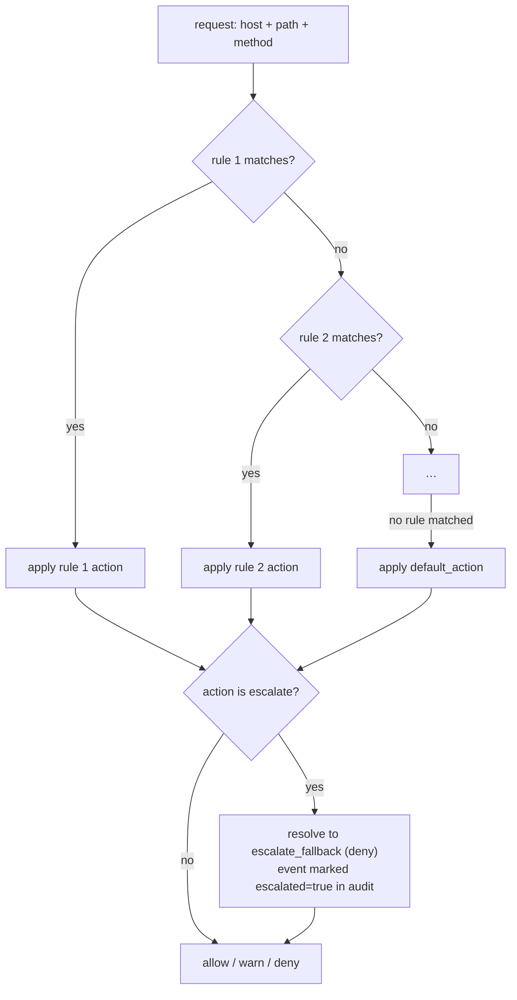

# Policy reference

Decoyrail's egress policy decides, for every intercepted request, whether it
may leave the machine. It is a plain TOML file, `~/.decoyrail/policy.toml`,
created with a default pack on first run and hot-reloaded by a running proxy.

```sh
decoyrail policy show               # print the current policy
$EDITOR "$(decoyrail policy path)"  # edit it by hand...
decoyrail policy sign               # ...then bless the edit; the proxy picks it up
```

You can also drive the rules from the command line, the way `iptables` does, without opening the file. Every write validates before it lands and needs no blessing; see [Editing from the CLI](#editing-from-the-cli) below.

The policy is the gate that decides where real secrets go, so the proxy loads only a policy that Decoyrail itself wrote or that you blessed with `decoyrail policy sign`; a file changed any other way fails closed. See [Integrity](#integrity-out-of-band-edits-never-load).

## File format

```toml
default_action = "deny"       # applied when no rule matches
escalate_fallback = "deny"    # what `escalate` resolves to today (no judge tier yet)

[[rule]]
name = "anthropic"                     # label; shows up in `decoyrail log`
hosts = ["api.anthropic.com"]          # required; glob per entry
methods = ["POST"]                     # optional; empty = any method
path_prefixes = ["/v1"]                # optional; empty = any path
action = "allow"                       # allow | deny | warn | route | escalate
allow_secrets = ["anthropic"]          # optional; secrets released here
# route = { "claude-opus-4" = "claude-sonnet-5" }  # model map; route rules only

[dlp]                                  # sensitive-data detectors
pan = "warn"                           # block | mask | warn | off
ssn = "warn"
iban = "warn"
aba = "warn"
email = "off"
# allow = ["4111 1111 1111 1111"]      # fixture values the detectors ignore
# debug = true                         # dump hit payloads for inspection
```

## Evaluation: top to bottom, first match wins



A rule matches when all of its constraints hold:

| Field | Semantics |
|---|---|
| `hosts` | at least one glob matches the destination host (case-insensitive) |
| `methods` | empty = any; otherwise case-insensitive exact match |
| `path_prefixes` | empty = any; otherwise the request path must start with one of them (the path includes the query string) |

Host globs support exact names, a bare `*` (any host), and a single leading
`*.` wildcard. `*.example.com` matches `api.example.com` and `example.com`
itself, but never `example.com.evil.net`.

## Ordering is the policy language

First-match-wins means position expresses precedence. The usual pattern is
to carve an exception out of a broader allowance by placing the narrow rule
above it:

```toml
# Deny one telemetry path…
[[rule]]
name = "no-event-logging"
hosts = ["api.anthropic.com"]
path_prefixes = ["/api/event_logging/"]
action = "deny"

# …while allowing the rest of the host.
[[rule]]
name = "anthropic"
hosts = ["api.anthropic.com"]
action = "allow"
```

Method scoping works the same way: allow reads, take a closer look at writes.

```toml
[[rule]]
name = "gist-read"
hosts = ["gist.github.com"]
methods = ["GET", "HEAD"]
action = "allow"

[[rule]]
name = "gist-other"
hosts = ["gist.github.com"]
action = "escalate"
```

## `allow_secrets`: which credentials travel with a rule

Reachability and secret release are decided by the same rule. A rule's
`allow_secrets` lists the secrets expected at the destinations it matches,
two ways:

- **By name:** `allow_secrets = ["aws"]` releases the vault entry named
  `aws`. Session secrets auto-decoyed from the environment are named after
  their variable, so `allow_secrets = ["env:AWS_SECRET_ACCESS_KEY"]`
  releases that one without adding it to the vault.
- **By provider label:** `allow_secrets = ["provider:github"]` releases any
  secret whose value has that provider's format, including the session
  secrets `decoyrail run` auto-decoys from your environment. Labels:
  `anthropic`, `openai`, `github`, `gitlab`, `slack`, `npm`.

What happens to a listed secret depends on the rule's action. On a rule that resolves to **allow**, the decoy is swapped for the real value (over TLS, in the [location](vault-and-bindings.md) the secret rides in). On a **deny** or **escalate** rule, the request blocks without swapping, and without raising the honeytoken alarm: your agent's own credential riding a denied telemetry call is expected, not an exfiltration signal. On a **warn** rule, the request forwards with the decoy still in place, again without the alarm: only allow ever releases a secret. A decoy the winning rule does not list at all is always a tripwire.

Because the winning rule decides everything, ordering buys you a useful
posture: a scoped rule without `allow_secrets` above a broad rule with it
makes a sub-path reachable but credential-free.

```toml
# Reachable, but no secret is ever released on /public…
[[rule]]
name = "public-reads"
hosts = ["api.acme.com"]
path_prefixes = ["/public"]
action = "allow"

# …while the rest of the host gets the real key.
[[rule]]
name = "acme"
hosts = ["api.acme.com"]
action = "allow"
allow_secrets = ["acme"]
```

The flip side of first-match-wins: a broad allow rule placed above your
releasing rule silently turns the credential into a tripwire, because the
releasing rule can never win. Decoyrail warns about that (and about
`allow_secrets` entries that match nothing) when the policy loads and on
`decoyrail policy show`. Warnings never block the load.

## `warn`: forward, but say so

`warn` forwards a request the way allow does, with two differences: the audit log records it as a distinct `warn` event (rendered `[WARN]` in `decoyrail log -t`, counted separately in `decoyrail stats`), and no secret is ever released. A warn rule that lists a secret in `allow_secrets` forwards the request with the decoy still in place, quietly; a decoy the rule does not list still trips the honeytoken alarm and blocks. The other overrides keep their precedence too: a blocking DLP hit or an exhausted budget denies a request that would otherwise ride a warn.

Its main use is as the default action while you tune a policy. With `default_action = "warn"` (or, for one session, `decoyrail run --watch`, which pins the default to warn without touching the file), an agent hitting an unlisted host keeps working, and the log tells you exactly which hosts are riding the default so you can write the allow or deny rules you actually want. Named deny and escalate rules still block in this mode.

Be honest with yourself about the tradeoff: warn does not block the exfiltration of non-secret data (source code, prompts) to unlisted hosts, it records it. The shipped default stays deny, and the [threat model](threat-model.md#warn-mode-records-it-does-not-block) spells this out. Treat warn as the tuning posture with an exit, not a place to live: watch the log, add rules, go back to deny.

## `route`: allow, on a cheaper model (Pro)

`route` is the model router (the standing-policy sibling of the [budget soft-landing](audit-and-metering.md#budget-soft-landing-pro)). A route rule allows exactly like `allow`, and additionally rewrites the requested model per its explicit map before the request forwards:

```toml
[[rule]]
name = "anthropic-cheap-tier"
hosts = ["api.anthropic.com"]
action = "route"
allow_secrets = ["provider:anthropic"]
route = { "claude-opus-4" = "claude-sonnet-5" }
```

Policy-wise it is an allow. Secrets release through `allow_secrets` the same way, first-match-wins ordering applies unchanged (a deny or escalate rule above it wins), and a tripwire, a blocking DLP hit, or an exhausted budget denies a routed request exactly as it denies an allowed one. Security verbs always outrank the route.

The map is yours, like the soft-landing map: Decoyrail has no built-in opinion about which models are equivalent. Only the top-level `model` field of recognized LLM request bodies (the Anthropic and OpenAI JSON shapes) is rewritten, byte-surgically, so everything else in the request is exactly what the client sent. A rule with no map, or a request whose model is absent, unmapped, or unidentifiable, forwards unmodified. Never an error, never a guess.

Rewrites never happen silently:

- every rewritten request gets a `route` audit event naming the rule and the mapping,
- the response carries an `x-decoyrail-route: <from> -> <to>` header,
- `decoyrail status` lists the policy's route rules and says when they are inert for want of a license.

Provider prompt caches are model-scoped, so a rewrite abandons any warm cache for the original model; the audit note says so, and when the [cache doctor](audit-and-metering.md#the-prompt-cache-report) knows a warm prefix for that model it prices what the rewrite forfeits, so a route that costs more than it saves is visible instead of mysterious. A map that names a target model the pricing table doesn't know still forwards as configured (the provider errors informatively); the audit note and the policy lint flag the likely typo, as does a route rule whose map is empty.

When the budget soft-landing is also active and the session is in its band, soft-landing rewrites first and the route map applies to the result, so the map is always consulted against the model actually about to forward. Both rewrites get their own audit events.

This is a Pro feature, and the gate moves in only one direction: without a license the rule still allows (license state never changes what is reachable), the model just rides through untouched.

`decoyrail policy add my-rule --host api.anthropic.com --action route` creates a route rule from the CLI; the map itself is edited in the file (`decoyrail policy edit`, or a hand edit plus `decoyrail policy sign`), which validates it like any other policy change.

## `escalate`: fails closed today, judge later

`escalate` marks a destination as "needs a second opinion": pastebins,
tunnel services, anything an agent has legitimate but abusable reasons to
reach. Until the LLM-as-judge / human-approval tier arrives (it's on the
[roadmap](../ROADMAP.md)), an escalated request resolves to
`escalate_fallback`, which defaults to deny.
The audit event records `escalated: true`, so you can see what a judge would
have been asked about.

## The default pack

On first run Decoyrail writes a policy tuned for coding agents: allow the AI
provider APIs (`api.anthropic.com`, `statsig.anthropic.com`,
`console.anthropic.com/v1/oauth…` for Claude subscription token refresh,
`api.openai.com`), GitHub (`github.com`, `api.github.com`,
`codeload.github.com`, `*.githubusercontent.com`), and package registries
(`registry.npmjs.org`, `pypi.org`, `*.pythonhosted.org`, `crates.io`,
`static.crates.io`); escalate pastebins and tunnels (`pastebin.com`,
`*.ngrok.io`, `*.ngrok-free.app`); allow gist reads but escalate gist
writes; deny everything else. The provider rules release the matching
provider labels (`provider:anthropic` at Anthropic's API, `provider:github`
at GitHub, and so on), which is why auto-decoyed keys keep working with no
setup.

There is one carve-out inside the GitHub allowance: the Gist REST API
(`api.github.com/gists…`) escalates rather than riding the broad
`api.github.com` allow, because creating a gist is a one-POST exfiltration
channel on a host agents otherwise need. The path-scoped rule sits above the
host-wide one; the carve-out depends on that ordering. It also lists
`provider:github`, so the agent's token riding a blocked gist call is
denied quietly instead of tripping the honeytoken alarm.

The pack also carries a `[dlp]` section with the
[sensitive-data detectors](dlp.md) in warn mode: card numbers, SSNs, and
bank identifiers riding an outbound request are recorded as alerts, and you
upgrade a detector to `block` or `mask` once you have watched your own
traffic (`decoyrail dlp set pan block`).

Run `decoyrail policy show` to see the live version. The file on disk is the
source of truth.

## `[cache]`: the Pro cache controls

The free [prompt-cache doctor](audit-and-metering.md#the-prompt-cache-report) always runs and only observes. The `[cache]` table is how you switch on the three active behaviors it diagnoses for, described in [Cache repair and active management](audit-and-metering.md#cache-repair-and-active-management-pro). Each one needs two things: the knob set here, and a Pro license installed. Without a license the knobs are inert and every request passes through byte-identical; nothing errors and nothing blocks.

```toml
[cache]
repair = true              # splice a cache_control marker when a prefix repeats unmarked
keep_alive = true          # pre-warm a warm cache during idle so it survives a long build
keep_alive_secs = 240      # idle seconds before a pre-warm fires (default sits under the 5m TTL)
keep_alive_max = 6         # pre-warms per prefix per session; a real request resets the count
serialize_fanout = true    # parallel same-prefix requests: one cache write, the rest read it
fanout_timeout_ms = 2000   # how long a held request waits for the leader before proceeding
```

Everything defaults to off or to the safe value shown, and the table hot-reloads like the rest of the policy. Every marker injection and every proxy-initiated pre-warm lands in the audit log (`cache` and `keepalive` events), and `decoyrail cache` reports what the active layer actually did.

These are cost knobs, not security knobs: a `[cache]` table can never release a secret, loosen a rule, or keep a deny from denying. A pre-warm the proxy initiates runs the full policy and swap pipeline, exactly like a request your agent sent.

## Editing from the CLI

The file is always yours to edit by hand, but for routine changes the
`decoyrail policy` subcommands do the same edits without an editor, and they
keep you from writing a policy the proxy would refuse. Every mutation validates
that the result still parses, preserves the comments and the rules it doesn't
touch, keeps a single most-recent backup at `policy.toml.bak`, replaces the
file atomically so a running proxy never reads a half-written policy, and
leaves the file [trusted](#integrity-out-of-band-edits-never-load) with an
audit event recording the change, so no blessing step is needed.

### Reading

```sh
decoyrail policy ls                 # rules in evaluation order, with positions
decoyrail policy ls --json          # the same, machine-readable
decoyrail policy test https://api.github.com/gists --method POST
```

`policy test` evaluates a URL exactly as the proxy would and tells you which
rule wins, the resolved action (including when an `escalate` fell through to
the fallback), and which secrets that rule would release there. It changes
nothing and works while the proxy is running, so it's the quickest way to
confirm an edit did what you meant.

### Writing

```sh
# Append an allow rule (append is the default, like `iptables -A`).
decoyrail policy add stripe --host api.stripe.com --action allow \
  --allow-secret stripe

# Insert where order matters (like `iptables -I`): by position, or relative
# to a neighbor. First-match-wins, so a carve-out has to sit above the broad
# rule it carves out of.
decoyrail policy add block-settings --host github.com \
  --path-prefix /settings --action deny --before github

# Change just one field of a rule (addressed by name or by its ls position).
decoyrail policy set gist-other --action deny
decoyrail policy set 7 --host github.com --host api.github.com

# Move, delete, and set the defaults.
decoyrail policy mv block-settings 1
decoyrail policy rm stripe
decoyrail policy default deny
decoyrail policy default allow --fallback   # set escalate_fallback instead

# Start over.
decoyrail policy flush     # remove all rules, keep the default action
decoyrail policy reset     # restore the shipped default pack

# Or open the whole file in $EDITOR, validated before it replaces the live
# one (like visudo): a broken edit is rejected and the live policy stays put.
decoyrail policy edit
```

A rule is addressed by its name or by the 1-based position `policy ls` shows.
`--host`, `--method`, `--path-prefix`, and `--allow-secret` are repeatable; on
`set`, repeating a flag replaces that whole list, and the `--clear-*` flags
empty one. After every write, Decoyrail reruns the policy lint and prints any
warnings inline, so a rule that can never win (shadowed by a broader rule
above it) or an `allow_secrets` entry that matches nothing shows up right when
you make the change, not at the next load.

`rm`, `flush`, and `reset` ask before they act on a terminal, and require
`--yes` when run from a script. Any command that fails leaves the file
untouched and exits non-zero, so you can chain them safely in a shell script.

## Integrity: out-of-band edits never load

Every policy Decoyrail writes gets a record next to it, `policy.toml.sig`: a keyed checksum over the exact file bytes, with the key derived from the same vault key that encrypts your secrets. The proxy loads a policy only when that record verifies. There is no flag for this and no off switch; it applies in every home, and its strength tracks the vault-key backend you already chose (a keychain-held key on macOS after `decoyrail key migrate --to keychain`, a `0600` file otherwise). `decoyrail key migrate` moves both protections together.

Hand edits stay a supported workflow, one command longer:

```sh
$EDITOR "$(decoyrail policy path)"   # edit the file
decoyrail policy sign                # review the diff, confirm, done
```

`policy sign` shows what changed against the last trusted version and asks for confirmation. It only runs on a terminal: the point is that a human read the diff. Signing a file that is already trusted is a quiet no-op, and signing one that does not parse is refused, so a typo cannot become a deny-all surprise at the next restart.

What happens when the file does not verify:

- At startup, the proxy refuses to run and tells you what to do (review, then `decoyrail policy sign`). The refusal is also written to the audit log as a `tamper` event.
- On a running proxy, the last good policy stays in force and the rejection lands in the audit log as a `tamper` event; `decoyrail log -t` renders it as `[TAMP]`, with the same prominence as a honeytoken alarm.
- `decoyrail policy ls` prints whether the file on disk is currently trusted, so "will my next restart work" is answerable without restarting.
- CLI mutations (`policy add`, `dlp set`, ...) refuse to build on an untrusted file, so they cannot silently launder a tamper; `policy sign` and `policy reset` are the two ways back to a trusted state.

Deleting `policy.toml.sig`, deleting `policy.toml` while the record exists, or copying a policy plus record from another home all fail closed the same way. Restoring a tampered file byte-for-byte makes it load again with no blessing, since the record covers the exact bytes.

After an upgrade from a version without integrity records, the first start refuses with the same instructive error: review your policy once, run `decoyrail policy sign`, and you are done.

Honesty note: this is detection, not a cage. Whoever can run code as you can run `decoyrail policy set` themselves; the difference is that the change then rides Decoyrail's own audited path and shows up in the log and the live tail. On the file key backend, an attacker who reads `vault.key` can forge the record too, exactly as they could already open the vault. The [threat model](threat-model.md) spells this out.

## Interaction with the rest of the pipeline

Policy is necessary but not sufficient for a request to leave:

- A **tripwire** (a decoy the winning rule does not list) denies even on an
  allowed or warned host.
- A blocking **[DLP detector](dlp.md) hit** (a card number, SSN, or bank
  identifier with the detector set to `block`) denies even on an allowed
  or warned host.
- An **exhausted budget** denies everything until the month rolls over or
  the budget is raised.
- An **allow** without `allow_secrets` does not swap anything: the host is
  reachable, but every credential stays a decoy. The swap additionally
  requires TLS transport and the right
  [location](vault-and-bindings.md); a decoy in a URL or in an encoded form
  is never swapped, anywhere.
