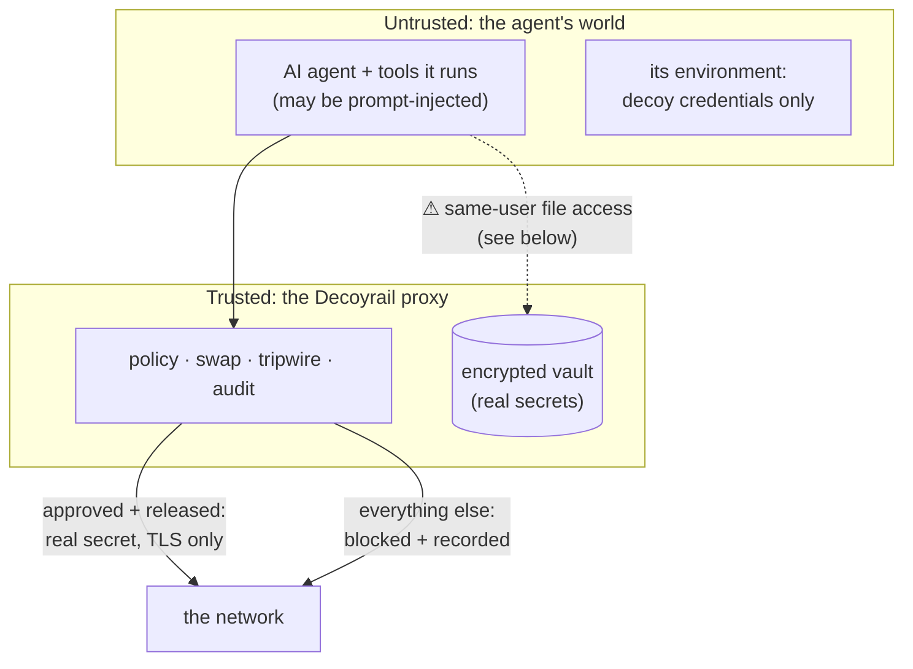

# Threat model

Decoyrail currently runs as an explicit local proxy for the agent's HTTPS
traffic. This page defines its security scope and limits; [How it
works](how-it-works.md) explains the mechanisms.

Same-user mode guards against accidents and prompt-driven
exfiltration along the configured network path. It does not enforce a
boundary against arbitrary hostile code running as your user.

## The trust boundary

The design assumption: the agent, including anything a prompt injection
makes it do, is untrusted. Everything it can freely reach (its env, its
files, its child processes) therefore contains no real secrets. The proxy
is the only component that touches real values, and only in the moment
between interception and forwarding.

## What Decoyrail defends against

- **Secret exfiltration to unapproved destinations.** The agent only ever
  holds a decoy. The real secret is swapped in solely where the winning
  policy rule releases it (`allow_secrets`), in the location the secret
  rides in, and only over TLS. A decoy sent anywhere else, whether
  literally, base64/hex/percent-encoded, in the URL, in the wrong header,
  or over plaintext, is blocked and recorded.
- **Off-policy egress.** Default-deny; only allowlisted destinations are
  reachable, and every request is recorded.
- **Redirect smuggling.** The upstream client follows no redirects, so a
  3xx can't carry an already-swapped secret to a host policy never
  evaluated.
- **Credential leakage into agent artifacts.** Prompts, logs, shell
  history, crash dumps, and context windows can only ever contain decoys,
  which are useless anywhere except as tripwire bait.
- **Credentials the user never vaulted.** `decoyrail run` auto-decoys
  sensitive-looking env vars into a session vault, so a prompt-injected
  agent reading its own environment finds decoys, not keys. (Limits below.)
- **Tamper-evident history.** Edits, mid-file deletions, and (via the head
  anchor) tail truncation of the audit log are detectable with
  `decoyrail log --verify`. See [audit & metering](audit-and-metering.md).
- **Policy tampering in place.** The policy loads only when it verifies
  against a keyed record Decoyrail wrote alongside it, with the key derived
  from the vault key. An out-of-band edit (or a deleted record, or a policy
  copied in from another home) fails closed: a fresh start refuses with
  instructions, and a running proxy keeps the last good policy and writes a
  `tamper` audit event with alarm prominence. Blessed changes
  (`decoyrail policy sign`) and CLI edits leave a fingerprinted trail in the
  audit log. Detection, not prevention; the honest limits are below.

## What Decoyrail does *not* defend against (in this mode)

### A same-user attacker and `~/.decoyrail`

The encrypted vault, CA key, and policy live in `~/.decoyrail`, owned by the user the agent runs as. On the file backend (dev builds, overridden homes, installs that migrated back) the vault key (`vault.key`) sits beside them, so a prompt-injected agent can read both files and decrypt the vault offline; no tripwire fires, because nothing traversed the proxy.

On macOS the keychain backend closes the silent-read path: a release install starts there on first run, and `decoyrail key migrate --to keychain` moves an existing file key in. The key lives in a login-keychain item that only the Decoyrail
binary reads without a prompt, bound to the default home. That binding
also closes the rented-deputy variant, where the attacker never reads the
key at all but copies the encrypted vault next to a hostile policy and
starts `DECOYRAIL_HOME=/tmp/evil decoyrail run`, letting a fresh Decoyrail
unlock the key and release real secrets for them. A non-default home never
consults the keychain, so the hostile copy cannot decrypt the real vault.
Details in
[vault-and-bindings](vault-and-bindings.md#where-the-key-lives-file-or-keychain).

What remains open, stated plainly:

- **The deputy signs.** A same-user attacker who edits `policy.toml`
  directly now trips the fail-closed load, but the same attacker can run
  `decoyrail policy set` instead; the CLI is a convenience over the same
  authority. What changed is that the edit rides Decoyrail's own audited
  path: every policy change is in the hash-chained log with a fingerprint,
  and the live tail can say "policy changed" as it happens. Detection, not
  prevention.
- **Record forgery on the file backend.** The policy record is keyed from
  the vault key, so its strength tracks the key backend: with `vault.key` in
  a plain file, an attacker who reads it can forge the record, exactly as
  they could already decrypt the vault. The keychain backend raises both to
  a consent prompt in one move, and a consistent same-user attacker can
  still rewrite every piece of Decoyrail state together, audit log included.
  Bar-raising, not a cage; prevention awaits the privileged system mode.
- **Rollback.** A saved older policy-plus-record pair still verifies if
  restored together. Each blessing's fingerprint is in the audit log, so a
  rollback is discoverable by comparing the loaded policy against the newest
  blessing; the same attacker can also rewrite the log, which is the
  bar-raising argument again.
- **Consent fatigue.** The keychain turns silent key theft into a visible
  consent prompt; it cannot make a careless approval impossible. A Secure
  Enclave item behind Touch ID is the stronger follow-up.
- **Binary replacement.** Replacing the Decoyrail binary breaks the item's
  application match, so the next read prompts (a detection), but binary
  integrity at rest is otherwise assumed.
- **Unsigned builds re-prompt.** A dev build is identified by the binary
  itself rather than a stable code signature, so every rebuild re-prompts.
  The file backend stays the default for development for this reason.

Until the privileged system mode ships (daemon under a dedicated service
user owning the state dir, write-only vault; see the
[roadmap](../ROADMAP.md)), treat the vault and policy as protecting
against network exfiltration, plus (with the keychain backend) against
silent local key theft, not against everything code running as you can do.

### An agent that bypasses the proxy

Explicit-proxy mode relies on the agent honoring `HTTPS_PROXY`. This is by
design: the proxy is the only road to a real secret, not a cage around the
agent. Traffic that ignores the proxy carries only the decoy (never a
real value); the worst case is a failed request, and the decoy still
tripwires if it later crosses any path Decoyrail does see. Machine-wide
capture (a Network Extension) is on the [roadmap](../ROADMAP.md) for tools
that must be covered without cooperating.

### Local credential files are not covered

Decoyrail protects what it injects: env vars and vault-backed decoys. It
does not confine the child's filesystem access. An agent that reads
`~/.aws/credentials`, `~/.ssh/id_ed25519`, or any other local file by path
gets the real contents. Keep secrets you care about in the vault (and out
of world-readable dotfiles), or run the agent inside whatever sandbox it
ships with; most coding agents (Claude Code among them) already sandbox
themselves, and terminal environments commonly add their own.

### Automatic decoying is best-effort coverage

The env guard in `decoyrail run` has the same posture as `HTTPS_PROXY`
itself: it covers tools that behave normally, and makes no promise against
an adversary with full local access.

- **Detection is heuristic.** Env scanning matches credential-shaped names
  and known value formats. A secret in a var named `BLOB` with no
  recognizable format passes through undetected. The launch banner lists
  what was caught; check it.
- **Some decoyed credentials cannot stay usable.** AWS keys sign requests
  (SigV4) instead of riding in them, so no swap can repair a request signed
  with a decoy; AWS calls from the child fail until SigV4 re-signing ships.
  These are registered tripwire-only: unusable by design, with any literal
  or encoded sighting of the decoy still blocked.
- **Direct non-HTTP protocols are invisible.** A decoyed `DATABASE_URL`
  breaks direct database connections (the proxy only sees HTTP), which is
  the intended posture; use `--pass-env DATABASE_URL` if you accept the
  exposure instead.

### Warn mode records, it does not block

The `warn` action (and `decoyrail run --watch`, which makes it the default for one session) forwards requests to hosts no rule matches instead of denying them. In that posture, exfiltration of non-secret data (source code, prompts, file contents) to an unlisted host is not prevented; it is recorded as a `warn` audit event. The secret guarantees are unchanged: warn never releases a real secret, an unexpected decoy still trips the alarm and blocks, and DLP blocks and budget stops still win. The shipped default stays deny; warn is a posture you choose explicitly, meant for tuning a policy (watch the log, add rules, return to deny), not for living in. `decoyrail stats` counts warn traffic per host so you can see how much is riding the default.

### Encoding/obfuscation beyond the scanned forms

The tripwire scans for the literal decoy plus its base64 (padded and
unpadded), URL-safe base64, hex (upper/lower), and percent-encoded forms,
in the URL, headers, and bodies (including non-UTF-8 bodies for the literal
bytes). A decoy that is gzip-compressed, encrypted, split across requests,
or double-encoded before leaving will evade a stateless scan. This is
detection in depth: a honeytoken catches most attempts without any
guarantee of catching them all.
The prevention guarantee doesn't depend on it: the real secret is never
substituted toward an unapproved destination, no matter how the decoy was
disguised.

### DLP detectors cover structured data only

The [request-side detectors](dlp.md) catch checksummed, structured
identifiers: card numbers, dashed SSNs, IBANs, routing numbers, emails.
Names, addresses, and free-text health or personal data need judgment
rather than rules, and wait for the local judge model. Decoyrail makes no
HIPAA claim.
Like the tripwire, the encoded-form scan goes one decode level deep within a
bounded budget; compressed, encrypted, or double-encoded values evade it.

### Cert-pinned applications

Pinning defeats the interception by design. The initial targets (CLIs like
Claude Code and Codex) don't pin; pinned apps fall back to allowlist-only
mode: egress control and metering, no body inspection or swap.

### In-memory secret exposure

Vault key material and decrypted vault plaintext are zeroized after use,
but the real value still lives in a plain `String` in the running proxy's
memory while loaded. End-to-end zeroize-on-drop is planned but not there yet.

### Response-side leaks are alerted, not blocked

Bounded (≤1 MiB) non-SSE responses are scanned for echoed real secrets; a
hit records an `alert` audit event, but the response has already reached
the agent by then. SSE streams are not scanned at all (latency). Treat this
as telemetry.

## Design invariants

If you're auditing the code, these are the properties everything else leans
on, and the ones to check a change against:

1. Real secrets leave the process only over TLS, only toward a destination
   whose winning policy rule releases them.
2. The upstream client never follows redirects and never honors proxy env
   vars.
3. Fail closed: unmatched destinations deny unless the operator explicitly chose warn; `escalate` resolves to deny until a judge exists; tripwire, DLP block, and budget exhaustion override an allow or a warn.
4. A decoy is never swapped when anything about the context is anomalous: no releasing rule, wrong header, in the URL, encoded form, plaintext transport. Anomalous means tripwire, with one deliberate exception: a secret the winning rule lists but does not release (a deny/escalate carve-out, or a warn rule) stays quiet, because the agent's own credential riding that request is expected traffic, not exfiltration. Warn forwards but sits on the unreleased side of this line, always.
5. Every decision produces an audit event that chains to the one before it.
